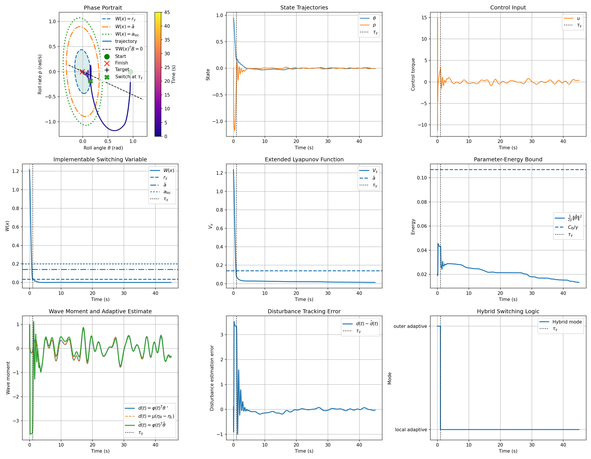
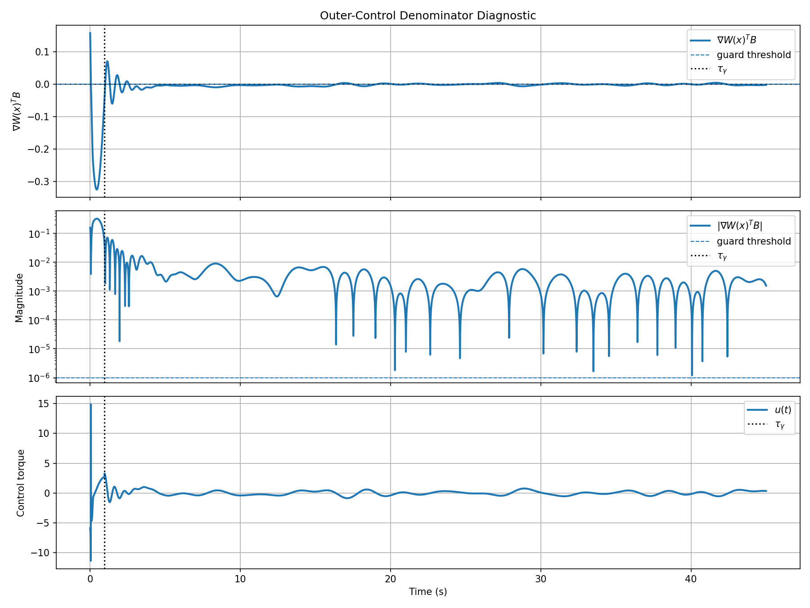
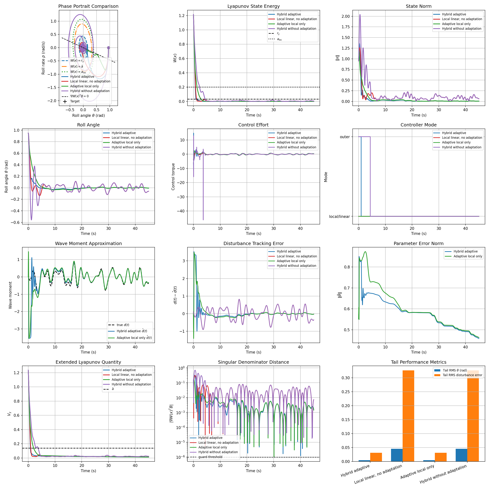

# Adaptive Ship-Roll Stabilization with Hybrid Lyapunov-PDE Control

This project studies adaptive stabilization of a nonlinear ship-roll model under an unknown matched wave-induced moment. The proposed controller combines an outer Lyapunov-PDE controller, a local adaptive stabilizer, and a projected parameter estimator. 

For a more detailed mathematical proofs of the hybrid adaptive construction, see [math_appendix.pdf](math_appendix.pdf).

The main result is that the implementable switching condition places the trajectory inside the extended Lyapunov-certified local set:

```math
V_\gamma(x(\tau_\gamma),\tilde\theta(\tau_\gamma))
\le
\bar a.
```

<p align="center">
  
</p>
<p align="center">
  <em>Concept animation: the outer adaptive Lyapunov-PDE law drives the roll state into the implementable switching set, while the adaptive Fourier estimate learns the unknown wave moment; after the transient, \(\hat d(t)\) follows \(d(t)\) and the residual error becomes small.</em>
</p>

<p align="center">
  <video src="adaptive_ship_stabilization.mp4" width="700" controls loop muted playsinline></video>
</p>
<p align="center">
  <em>Physical-system animation: ship-roll response under the stabilization controller.</em>
</p>

## Problem Definition

The control task is to stabilize the upright roll equilibrium

```math
x^\star =
\begin{bmatrix}
0\\
0
\end{bmatrix}
```

for the nonlinear ship-roll model

```math
\dot\theta = p,
\qquad
\dot p = -c p - k\sin\theta + u + d(t).
```

The state is

```math
x =
\begin{bmatrix}
\theta\\
p
\end{bmatrix},
```

where `theta` is the roll angle in radians and `p = dot(theta)` is the roll rate in rad/s. The scalar control input `u` is a roll torque. The unknown disturbance `d(t)` is a matched wave-induced roll moment.

## System Description

The system is written in matched control-affine form:

```math
\dot x = f(x) + B\left(u + d(t)\right),
```

with

```math
f(x)=
\begin{bmatrix}
p\\
-cp-k\sin\theta
\end{bmatrix},
\qquad
B=
\begin{bmatrix}
0\\
1
\end{bmatrix}.
```

The numerical parameters are

```math
c=0.85,
\qquad
k=2.20.
```

The wave disturbance is represented in two equivalent ways. First, the visual wave profile is

```math
\eta(y,t)=\sum_i A_i\sin(k_i y-\omega_i t+\psi_i).
```

The induced normalized roll moment is

```math
d(t)=\mu(\eta_R(t)-\eta_L(t)).
```

Second, the same moment is expressed in the parametric adaptive-control form

```math
d(t)=\varphi(t)^T\theta^\star,
```

where

```math
\varphi(t)=
\begin{bmatrix}
\sin(\omega_1 t)&
\cos(\omega_1 t)&
\cdots&
\sin(\omega_N t)&
\cos(\omega_N t)
\end{bmatrix}^T.
```

The unknown parameter vector `theta_star` is constant and belongs to the known ball

```math
\Theta=\{\theta\in\mathbb{R}^{2N}: \|\theta\|\le R_\Theta\},
\qquad
R_\Theta=0.65.
```

## Mathematical Specification

The linearization at the origin is

```math
A=
\begin{bmatrix}
0&1\\
-k&-c
\end{bmatrix},
\qquad
B=
\begin{bmatrix}
0\\
1
\end{bmatrix}.
```

The local feedback gain is

```math
K=
\begin{bmatrix}
-3.8&-2.4
\end{bmatrix}.
```

Thus

```math
A_{\rm cl}=A+BK=
\begin{bmatrix}
0&1\\
-6.0&-3.25
\end{bmatrix}.
```

The eigenvalues are

```math
\lambda_{1,2}=-1.625\pm 1.8329i,
```

so `A_cl` is Hurwitz. The quadratic Lyapunov matrix `P` solves

```math
A_{\rm cl}^T P + P A_{\rm cl} = -I.
```

Numerically,

```math
P=
\begin{bmatrix}
1.34775641&0.08333333\\
0.08333333&0.17948718
\end{bmatrix}.
```

The state Lyapunov function is

```math
W(x)=x^T P x.
```

The local certified level is chosen as

```math
a_{\rm loc}=0.20.
```

A numerical local-decay diagnostic over the sublevel set `W(x) <= a_loc` gives

```text
max dot(W)/W = -0.7311,
nonnegative samples = 0.
```

This supports the local nominal decay assumption used by the adaptive proof.

## Adaptive Method

The adaptive estimate is denoted by `theta_hat`. The parameter error is

```math
\tilde\theta=\hat\theta-\theta^\star.
```

The extended Lyapunov function is

```math
V_\gamma(x,\tilde\theta)
=
W(x)+\frac{1}{2\gamma}\|\tilde\theta\|^2.
```

The local adaptive controller is

```math
u_{\rm loc}(x,\hat\theta,t)
=
Kx-\varphi(t)^T\hat\theta.
```

The projected adaptive law is

```math
\dot{\hat\theta}
=
{\rm Proj}_\Theta\left(
\hat\theta,\,
\gamma\varphi(t)B^T\nabla W(x)
\right).
```

The projection keeps `theta_hat(t)` inside `Theta`. Since both `theta_hat` and `theta_star` remain in `Theta`, the parameter-energy term satisfies

```math
\frac{1}{2\gamma}\|\tilde\theta(t)\|^2
\le
\frac{C_\Theta}{\gamma},
\qquad
C_\Theta=2R_\Theta^2.
```

For `R_Theta = 0.65`,

```math
C_\Theta=0.845.
```

## Hybrid Switching Logic

The outer adaptive controller is

```math
u_{\rm ext}(x,\hat\theta,t)
=
-\varphi(t)^T\hat\theta
-
\frac{W(x)+\nabla W(x)^T f(x)}
{B^T\nabla W(x)}.
```

It is used while the state is outside the implementable switching set. The controller switches once to the local adaptive law after the first entrance into

```math
\Omega_\gamma=\{x: W(x)\le r_\gamma\}.
```

The design constants are

```math
\eta=0.06,
\qquad
\bar a=a_{\rm loc}-\eta=0.14,
```

```math
\gamma_\eta=6.3375,
\qquad
\gamma=7.921875,
```

and

```math
r_\gamma
=
\bar a-\frac{C_\Theta}{\gamma}
=
0.0333333.
```

The switch is based only on `W(x)`, which is measurable from the state. The proof uses `V_gamma`, which depends on the unknown `theta_star`, only as an analysis tool.

## Important Limitation

The general outer Lyapunov-PDE law requires

```math
B^T\nabla W(x)\ne 0
```

in the outer region where the outer law is applied. For this scalar-input two-state ship-roll example,

```math
B^T\nabla W(x)
=
2(P_{21}\theta+P_{22}p),
```

so the denominator is zero on a line through the origin. Therefore the ship example is not a global application of the nondegeneracy theorem. The implemented claim is trajectory-level: for the simulated outer segment, the trajectory stays away from the singular line until switching. The diagnostic plot `figures/diagnostics/singularity.png` is included to make this limitation explicit.

## Algorithm Listing

For the hybrid adaptive run:

1. Build the ship-roll plant with `c` and `k`.
2. Generate the deterministic wave disturbance and the corresponding unknown `theta_star`.
3. Linearize the plant at the origin.
4. Choose `K` and compute `A_cl = A + BK`.
5. Solve the Lyapunov equation for `P`.
6. Define `W(x)=x^T P x`.
7. Compute `C_theta`, `gamma_eta`, `gamma`, `a_bar`, and `r_gamma`.
8. Initialize `theta_hat(0)=0`.
9. If `W(x)>r_gamma`, apply the outer adaptive controller.
10. Once `W(x)<=r_gamma`, switch once to the local adaptive controller.
11. Integrate the closed-loop system with fixed-step RK4.
12. Save plots and diagnostics.

## Baseline Comparison

Project 2 requires a mandatory comparison. This repository compares the proposed method against three baselines:

1. `Local linear, no adaptation`: uses `u=Kx`. It cannot estimate the wave moment and leaves a larger residual roll response.
2. `Adaptive local only`: uses the local adaptive controller from the start, with no outer entrance phase. In this numerical run it performs well, but it starts outside the certified local level and is therefore not certified by the local theorem.
3. `Hybrid without adaptation`: uses the same hybrid outer/local structure but removes adaptive cancellation and parameter update. It shows why the wave estimate is needed under the matched disturbance.

The comparison figure reports phase portraits, `W(x)`, state norm, roll angle, control effort, controller mode, wave-moment approximation, disturbance tracking error, parameter error, the extended Lyapunov quantity, singular-denominator distance, and tail RMS metrics.

## Experimental Setup

Default parameters are stored in `configs/default.json`.

Important values:

- initial state: `x0 = [0.95, 0.0]`;
- simulation time: `45 s`;
- step size: `0.005 s`;
- wave harmonics: `N = 30`;
- random seed: `12`;
- parameter ball radius: `R_theta = 0.65`;
- singular denominator guard: `1e-6`.

## Reproducibility

Install dependencies:

```bash
pip install -r requirements.txt
```

Run the main hybrid adaptive experiment:

```bash
python run_hybrid_adaptive.py
```

Run the mandatory controller comparison:

```bash
python run_comparison.py
```

Run both:

```bash
python run_all.py
```

The scripts save figures to:

- `figures/hybrid_adaptive_control/plots.png`;
- `figures/diagnostics/singularity.png`;
- `figures/comparison/plots.png`.

Render the concept animation with ManimGL:

```bash
set PYTHONPATH=tools\manim_compat
py -3.12 tools\render_manim.py manim_scenes\hybrid_adaptive_idea.py HybridAdaptiveIdea -w -i --video_dir animations\manim_output --file_name idea --fps 24 -r 1280x720 -c "#05070b"
```

The final repository GIF is stored at `animations/idea.gif`. It is optimized from the raw Manim output to keep the file size practical. The same animation is also exported as `animations/idea.mp4` for easy sharing.

## Results Summary

The hybrid adaptive run gives:

```text
tau_gamma = 0.960000 s
W(tau_gamma) = 0.033072
V_gamma(tau_gamma) = 0.076495
a_bar = 0.140000
max parameter energy = 0.045571
C_theta/gamma = 0.106667
min |gradW^T B| in outer mode = 3.907469e-03
max |u| total = 14.898050
max |d_param - d_wave| = 5.939693e-15
```

<p align="center">
  
</p>
<p align="center">
  <em>Hybrid adaptive controller: phase portrait, state trajectories, control torque, Lyapunov quantities, parameter-energy bound, disturbance estimate, tracking error, and switching mode.</em>
</p>

<p align="center">
  
</p>
<p align="center">
  <em>Singularity diagnostic: the outer-control denominator is monitored explicitly. Only the outer segment before the vertical switching line is relevant for the outer law.</em>
</p>

<p align="center">
  
</p>
<p align="center">
  <em>Mandatory Project 2 comparison: the proposed hybrid adaptive controller is compared with local linear control, adaptive local-only control, and nominal hybrid control without adaptation; the wave-moment approximation and the residual tracking error are shown separately.</em>
</p>

The tail metrics over the final 10 seconds are:

| Controller | Tail RMS theta (rad) | Tail RMS disturbance error | Max absolute control |
|---|---:|---:|---:|
| Hybrid adaptive | 0.004570 | 0.030826 | 14.898050 |
| Local linear, no adaptation | 0.045483 | 0.326461 | 3.610000 |
| Adaptive local only | 0.004621 | 0.030828 | 4.197116 |
| Hybrid without adaptation | 0.045483 | 0.326461 | 46.291246 |

The adaptive local-only baseline performs similarly in this numerical scenario, but it lacks the certified outer entrance phase. The local linear and nominal hybrid baselines show substantially larger residual roll and disturbance error under the unknown wave moment.

## Code Structure

```text
.
|-- README.md
|-- requirements.txt
|-- math_appendix.pdf
|-- configs/
|   `-- default.json
|-- figures/
|   |-- hybrid_adaptive_control/
|   |   `-- plots.png
|   |-- diagnostics/
|   |   `-- singularity.png
|   `-- comparison/
|       `-- plots.png
|-- animations/
|   |-- idea.gif
|   |-- idea.mp4
|   `-- .gitkeep
|-- manim_scenes/
|   `-- hybrid_adaptive_idea.py
|-- tools/
|   |-- render_manim.py
|   `-- manim_compat/
|-- run_hybrid_adaptive.py
|-- run_comparison.py
|-- run_all.py
`-- src/
    |-- cli.py
    |-- core/
    |-- systems/
    |-- disturbances/
    |-- lyapunov/
    |-- adaptation/
    |-- controllers/
    |-- simulation/
    |-- experiments/
    `-- visualization/
```

Module responsibilities:

- `systems/`: nonlinear ship-roll plant and linearization.
- `disturbances/`: deterministic wave profile and matched parametric disturbance.
- `lyapunov/`: quadratic Lyapunov construction.
- `adaptation/`: projection onto the parameter ball.
- `controllers/`: hybrid adaptive controller and three baselines.
- `simulation/`: fixed-step RK4 closed-loop simulator.
- `experiments/`: configuration loading and experiment assembly.
- `visualization/`: ACM-style plots and diagnostics.
- root scripts: reproducible command-line entry points.
